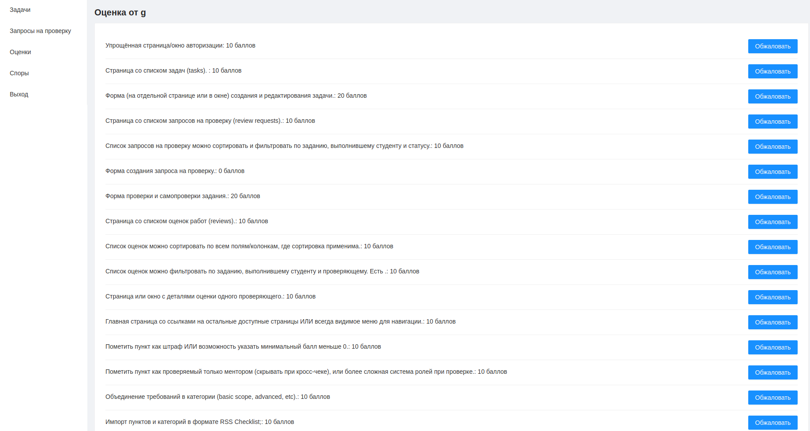

# X CHECK APP

Прототип приложения для студентов и менторов школы Rolling Scopes.

## Технологии

При разработке приложения использовались следуюущие технологии

-  [Create React App](https://github.com/facebook/create-react-app) 
-  [Antd](https://github.com/ant-design/ant-design/)
-  [React](https://reactjs.org/)
-  [TypeScript](https://www.typescriptlang.org/)
-  [Redux Toolkit](https://redux-toolkit.js.org/)
-  [Json-server](https://github.com/typicode/json-server)
-  [EsLint](https://eslint.org/)
-  [Prettier](https://prettier.io/)

## Demo

Прототип рабочего проекта развернут на Netlify [https://xcheck2020.netlify.app/](https://xcheck2020.netlify.app/)

## Сайт и логика приложения
- Страница авторизации. Нужно ввести свой ник на github и выбрать роль.

- Страница создания задачи (task). Доступна только для авторов.

- Страница выбора задачи. Представлена списком доступных задач. При нажатии автором создателем задачи происходит переход на страницу редактирования задачи, при нажатии любым другим автором - ничего не происходит. При нажатии пользователем происходит редирект на создание запроса на проверку задачи. Если пользователь уже создал задачу на проверку ранее, то открывается страница редактирования запроса на проверку.
 

 - Страница создания и редактирования запроса на проврку
 

 - Страница запросов на проверку. Если нажимает создатель заявки, то переходим на страницу редактирования запроса. Если проверяющий, то на страницу создания ревью или редиктаровани ревью.
  

 - Страница создания или редактирования ревью.
   
   

 - Страница ревью. Логика устроена аналогично предыдущим страницам
 

 - Страница просмотра ревью. Можно обжаловать любую оценку. Или принять полностью ревью.
 

 

 - Страница спора. Создатель ревью видит спорные вопросы от создателя запроса на проверку. Может принять или отказать в споре. При нажатии на принять происходит перерасчет ревью
 

 ##  Команды для проекта

 - yarn start
 - yarn build
 - yarn lint:fix
